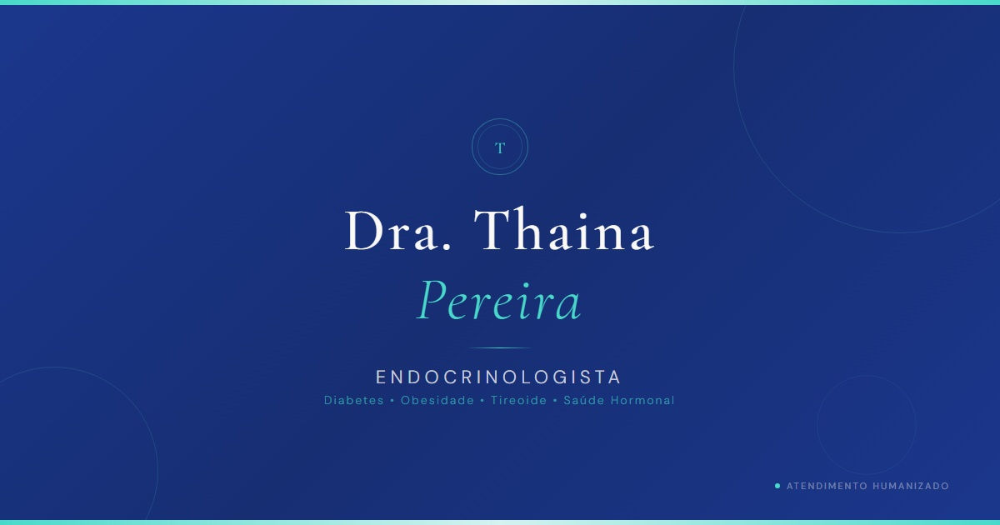

# 🩺 Dra. Thaina Pereira — Endocrinologista

<p align="center">
  
</p>

<p align="center">
  Landing page institucional moderna para a Dra. Thaina Pereira, médica endocrinologista no Brasil, com foco em performance, SEO, credibilidade profissional e conversão de pacientes.
</p>

<p align="center">
  
</p>

---

## 🌐 Visão Geral

Este projeto é uma **single-page application (SPA)** desenvolvida para representar a presença digital da Dra. Thaina Pereira.

O objetivo é unir:

- Apresentação profissional
- Autoridade médica
- Experiência fluida para o paciente
- Alta performance e SEO otimizado
- Conversão via WhatsApp e Instagram

---

## ✨ Funcionalidades

### 🧭 Navegação

- Navbar fixa com scroll suave entre seções
- Experiência contínua em página única

### 👩‍⚕️ Apresentação profissional

- Hero section com identidade visual forte
- Destaque para credibilidade e posicionamento médico

### 📚 Conteúdo institucional

- Sobre a médica
- Especialidades em endocrinologia
- Abordagem de atendimento humanizado

### 💬 Conversão

- Integração com WhatsApp (CTA principal)
- Formulário de contato
- Botão flutuante de contato rápido
- Integração com Instagram

### ⚡ Performance

- Lazy loading de imagens
- Build otimizado com Vite
- Componentização eficiente
- Tipagem estrita com TypeScript

---

## 🧠 SEO & Estrutura Semântica

Este projeto foi construído com forte foco em SEO médico.

### Meta Tags implementadas:

- Title otimizado:

  ```
  Dra. Thaina Pereira | Endocrinologista
  ```

- Description focada em intenção de busca:

  ```
  diabetes, obesidade, tireoide, menopausa, reposição hormonal, SOP
  ```

- Keywords médicas estratégicas
- Open Graph (OG) para redes sociais
- Twitter Cards
- Canonical URL
- Robots index/follow

### Schema.org (SEO avançado)

Implementado com:

```json
@type: Physician
```

Inclui:

- Nome da médica
- Especialidade (Endocrinology)
- Telefone
- Imagem profissional
- URL canônica

---

## 🛠️ Tech Stack

### Frontend

- React 19
- TypeScript 6 (strict mode)
- Vite 8 (`@vitejs/plugin-react`)

### Styling

- Tailwind CSS v4
- CSS-first configuration
- Design tokens via `@theme`

### Qualidade de código

- ESLint 10 (flat config)
- TypeScript strict

### Utilitários

- clsx
- tailwind-merge (`cn()` helper)

---

## 📂 Estrutura do Projeto

```text
src/
├── components/
│   ├── ui/
│   │   ├── LazyImage.tsx
│   │   ├── Loading.tsx
│   │   └── WhatsAppFloat.tsx
│   │
│   ├── Navbar.tsx
│   ├── Hero.tsx
│   ├── About.tsx
│   ├── Specialties.tsx
│   ├── Approach.tsx
│   ├── Instagram.tsx
│   ├── Consultation.tsx
│   └── Footer.tsx
│
├── icons/
├── App.tsx
├── main.tsx
├── index.css
└── util.ts

public/
├── logo_clean_light.svg
├── logo_clean_light.png
├── og-image.jpg
├── thaina.jpeg
└── assets/
```

---

## 🧩 Seções da Página

### 🟢 Hero

Primeira impressão da marca médica com CTA principal.

### 🟣 About

História profissional e abordagem humanizada.

### 🔵 Specialties

Áreas de atuação:

- Diabetes
- Obesidade
- Tireoide
- Menopausa
- Reposição hormonal
- Síndrome dos ovários policísticos (SOP)

### 🟡 Approach

Filosofia de atendimento centrado no paciente.

### 🟠 Instagram

Prova social e autoridade digital.

### 🟢 Consultation

Conversão direta via WhatsApp e formulário.

### ⚫ Footer

Contato, redes sociais e informações institucionais.

---

## 🎨 Design System

O projeto utiliza uma abordagem visual baseada em:

- Estética médica minimalista
- Paleta suave e profissional
- Tipografia elegante e legível
- Hierarquia visual clara
- Layout responsivo (mobile-first)

Fontes:

- Cormorant Garamond (títulos)
- DM Sans (texto)

---

## ⚡ Performance

O projeto foi otimizado para:

- Core Web Vitals
- Carregamento rápido inicial
- Imagens otimizadas
- Componentes reutilizáveis
- Bundle leve com Vite

---

## 🌍 Internacionalização

Conteúdo 100% em:

```text
Português (pt-BR)
```

---

## 🚀 Como rodar o projeto

### Instalar dependências

```bash
pnpm install
```

### Rodar ambiente de desenvolvimento

```bash
pnpm dev
```

### Build de produção

```bash
pnpm build
```

### Preview da build

```bash
pnpm preview
```

---

## 📜 Scripts

| Comando        | Função                      |
| -------------- | --------------------------- |
| `pnpm dev`     | Ambiente de desenvolvimento |
| `pnpm build`   | Build otimizada             |
| `pnpm preview` | Visualizar build            |
| `pnpm lint`    | Análise de código           |

---

## 🌎 Deploy

Compatível com:

- Vercel (recomendado)
- Netlify
- Cloudflare Pages
- Hospedagem estática (Nginx / Apache)

---

## 👩‍⚕️ Sobre a profissional

**Dra. Thaina Pereira**

Médica endocrinologista com atuação em:

- Saúde metabólica
- Diabetes
- Distúrbios hormonais
- Obesidade
- Saúde feminina hormonal

---

## 👨‍💻 Desenvolvimento

Projeto desenvolvido com foco em:

- Performance
- Escalabilidade
- UX/UI moderno
- SEO médico avançado
- Conversão de pacientes

---

## 📄 Licença

Projeto institucional desenvolvido sob demanda para a Dra. Thaina Pereira.

Todos os direitos reservados.
